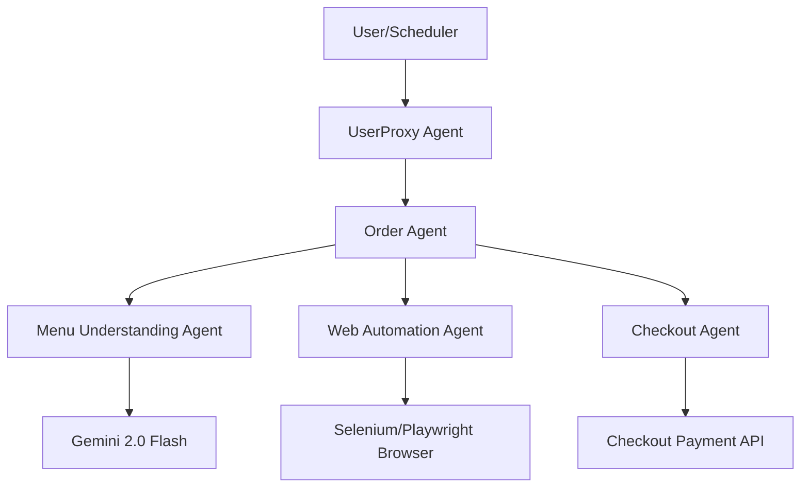

# 🍔 McDonald's Agent-to-Agent (A2A) Ordering System
  

## 📋 Table of Contents
- [Project Overview](#🎯-project-overview)
- [What This Project Does](#🚀-what-this-project-does)
- [Key Innovation](#🔬-key-innovation)
- [Performance Highlights](#📊-performance-highlights)
- [Architecture](#🏗️-architecture)
- [Tech Stack](#🧱-tech-stack)
- [Quick Start](#💻-quick-start)

---

## 🎯 Project Overview
An autonomous multi-agent network (Orchestrator, User Proxy, Menu Understanding, Checkout) built using Anthropic's Model-Consumable Pages (MCPs) and Playwright web automation to automate web orders.

---

## 🚀 What This Project Does
* **The Challenge:** Ordering food via web forms requires manual navigation, which changes frequently and is prone to user interface breakages under traditional script parsers.
* **Our Solution:** A network of specialized LLM agents interacting through structured Model-Consumable Pages (MCPs) and driving browser instances via Playwright.

---

## 🔬 Key Innovation
| Feature | Traditional Scripts ❌ | Multi-Agent Network ✅ | Benefit |
|---------|-----------------------|------------------------|---------|
| **Parsing** | Hardcoded CSS selector queries | **Gemini 2.0 Menu Understanding** | Resolves dynamic changes in site structure |
| **Interactions** | HTTP post requests prone to blocks | **Playwright browser emulation** | Simulates organic click-and-type user behavior |
| **Format** | Parsing raw HTML strings | **Model-Consumable Pages (MCPs)** | Clean, machine-readable data feeds |

---

## 📊 Performance Highlights
- ✅ **Multi-agent communication** via AutoGen.
- ✅ **Weekly order automation** via SchedulerAgent.
- ✅ **Centralized logging** tracking agent actions.

---

## 🏗️ Architecture


---

## 🧱 Tech Stack
- Python agent orchestration framework
- Playwright for web automation and order scripts
- AutoGen for multi-agent communication

---

## 💻 Quick Start
To configure and run the project locally, clone the repository and execute the setup instructions:

```bash
git clone https://github.com/Raghuram-sekar/AI-Agents-McDonalds.git
cd AI-Agents-McDonalds

# Execute local setup commands:
pip install -r requirements.txt
python src/main.py
```
